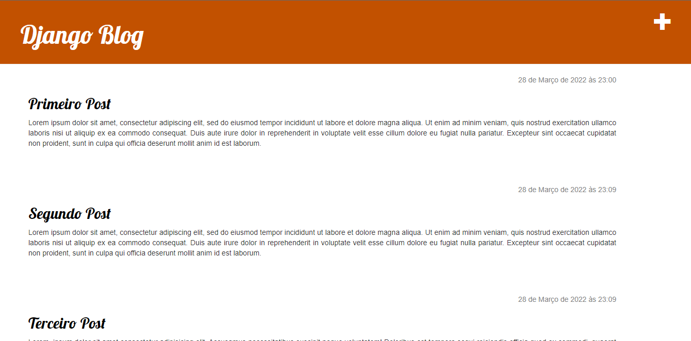
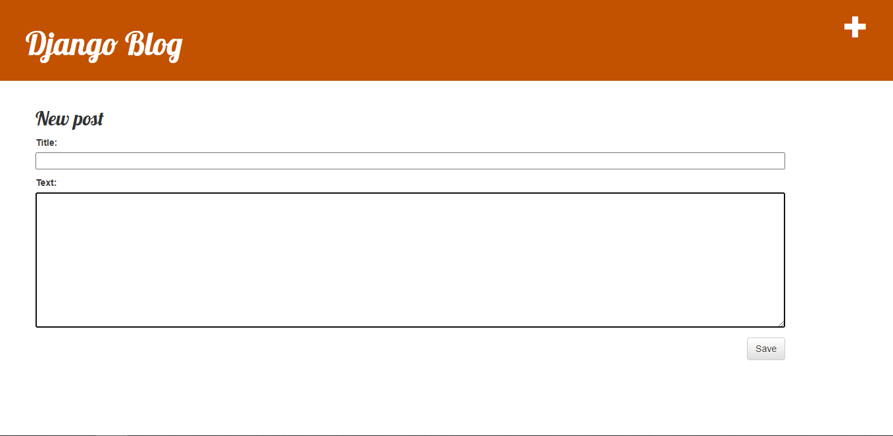
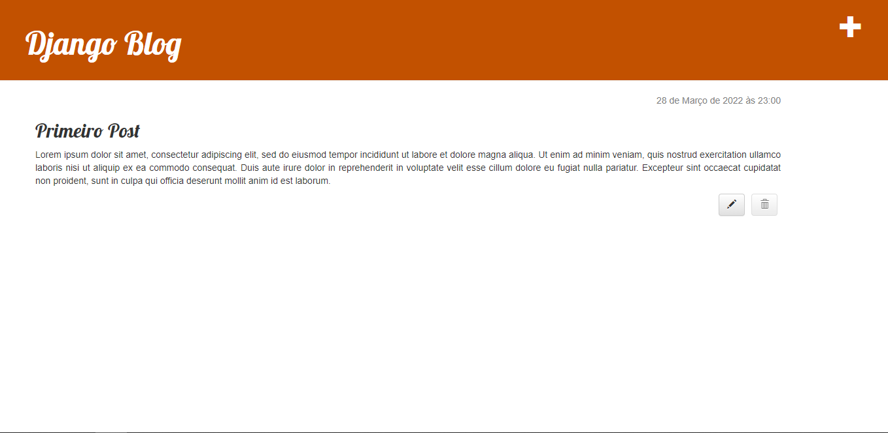
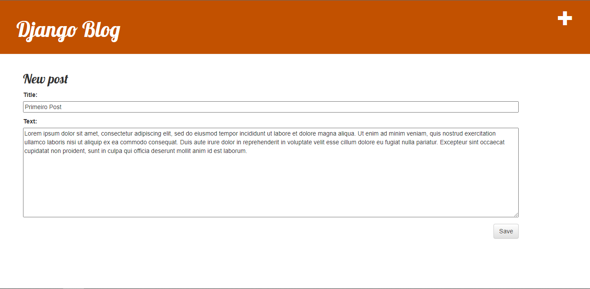

# DjangoBlog


## Ambiente virtual
```python
    $ mkdir djangogirls 
    $ cd djangogirls

    $ python3 -m venv myvenv or $ python -m venv myvenv
```
## Instalando o Django
```python
    $ python -m pip install --upgrade pip
    $ echo>requeriments.txt

    Adicione o seguinte texto ao arquivo djangoBlog/requirements.txt

        Django~=3.2.10

    $ pip install -r requirements.txt
```

## Crie uma conta no PythonAnywhere
• <a href="https://www.pythonanywhere.com/">PythonAnywhere</a>

## Documentação Python
• <a href="https://docs.python.org/pt-br/3/tutorial/">Documentação do Python</a>

## Criando Projeto Django
```python
    $ django-admin.exe startproject mysite .
```
## Mudando as configurações
    Depois de todas configurações alteradas, rodar as migrate
```python
    $ python manage.py migrate
```

## Iniciando o servidor web
```python
    $ python manage.py runserver or $ python manage.py runserver 0:8000

    http://127.0.0.1:8000/
```

## Criando uma aplicação
```python
    $ python manage.py startapp blog

```

## Criando um modelo de postagem para o nosso blog

```py
    from django.conf import settings
    from django.db import models
    from django.utils import timezone


    class Post(models.Model):
        author = models.ForeignKey(settings.AUTH_USER_MODEL, on_delete=models.CASCADE)
        title = models.CharField(max_length=200)
        text = models.TextField()
        created_date = models.DateTimeField(default=timezone.now)
        published_date = models.DateTimeField(blank=True, null=True)

        def publish(self):
            self.published_date = timezone.now()
            self.save()

        def __str__(self):
            return self.title
```
## Criando tabelas para nossos modelos no banco de dados
```python
    $ python manage.py makemigrations blog

    $ python manage.py migrate blog
```

# Django Admin
• <a href="http://127.0.0.1:8000/admin/">Administração do Django</a>
Crair super usuário
```python
    $ python manage.py createsuperuser

    adm
    adm@example.com
    adm12345
```

## O Shell do Django
```python
    $ python manage.py shell
```

```py
    >>> Post.objects.all()

    >>> from blog.models import Post

    >>> Post.objects.all()

    >>> Post.objects.create(author=me, title='Sample title', text='Test')

    >>> from django.contrib.auth.models import User

    >>> User.objects.all()

    >>> me = User.objects.get(username='adm')

    >>> Post.objects.create(author=me, title='Sample title', text='Test')

    >>> Post.objects.all()

    >>> Post.objects.filter(author=me)

    >>> Post.objects.filter(title__contains='title')

    >>> from django.utils import timezone
    >>> Post.objects.filter(published_date__lte=timezone.now())

    >>> post = Post.objects.get(title="Sample title")

    >>> post.publish()

    >>> Post.objects.filter(published_date__lte=timezone.now())

    >>> Post.objects.order_by('created_date')

    >>> Post.objects.order_by('-created_date')

    >>> Post.objects.filter(published_date__lte=timezone.now()).order_by('published_date')

    >>> exit()
    $
```
# Interface DjangoBlog


<br />

<br />

<br />
